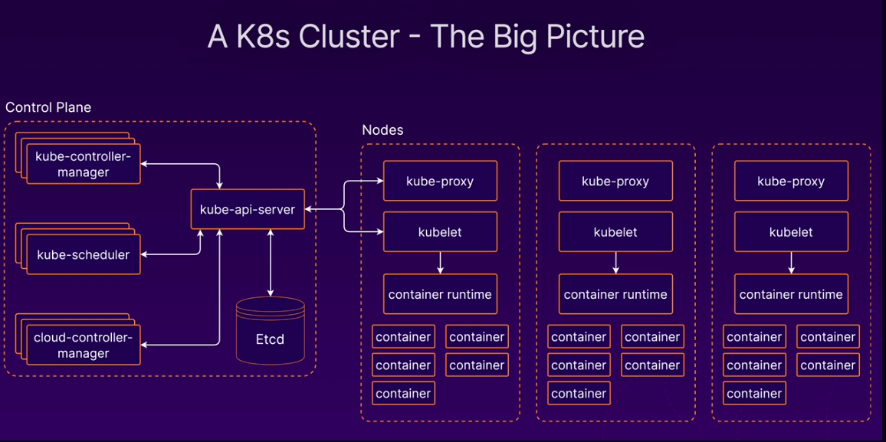

# kubernetes CKA
Content of this repository git is based on the course: [Certified Kubernetes Administrator (CKA)](https://learn.acloud.guru/course/certified-kubernetes-administrator)

## Kubernetes Componets
A Kubernetes cluster consists of a set of worker machines, called nodes, that run containerized applications. Every cluster has at least one worker node.
- https://kubernetes.io/docs/concepts/overview/components/

## Control Plane Componets
The control plane's components make global decisions about the cluster (for example, scheduling), as well as detecting and responding to cluster events (for example, starting up a new pod when a deployment's replicas field is unsatisfied). Control plane components can be run on any machine in the cluster.

### kube-apiserver
The API server is a component of the Kubernetes control plane that exposes the [Kubernetes API](https://kubernetes.io/docs/reference/generated/kube-apiserver/). The API server is the front end for the Kubernetes control plane.

### etcd
If your Kubernetes cluster uses etcd as its backing store, make sure you have a [back up](https://kubernetes.io/docs/tasks/administer-cluster/configure-upgrade-etcd/#backing-up-an-etcd-cluster) plan for those data.

### kube-scheduler
The Kubernetes scheduler is a control plane process which assigns Pods to Nodes. The scheduler determines which Nodes are valid placements for each Pod in the scheduling queue according to constraints and available resources.

### kube-controller-manager
Control plane component that runs [controller](https://kubernetes.io/docs/concepts/architecture/controller/) processes.
Some types of these controllers are:

- Node controller: Responsible for noticing and responding when nodes go down.
- Job controller: Watches for Job objects that represent one-off tasks, then creates Pods to run those tasks to completion.
- Endpoints controller: Populates the Endpoints object (that is, joins Services & Pods).
- Service Account & Token controllers: Create default accounts and API access tokens for new namespaces.

## Node Components
Node components run on every node, maintaining running pods and providing the Kubernetes runtime environment.

### kubelet
An agent that runs on each [node](https://kubernetes.io/docs/concepts/architecture/nodes/) in the cluster. It makes sure that containers are running in a [Pod](https://kubernetes.io/docs/concepts/workloads/pods/). A node may be a virtual or physical machine, depending on the cluster.

### kube-proxy
kube-proxy is a network proxy that runs on each node in your cluster, implementing part of the Kubernetes Service concept.

### Container runtime
The container runtime is the software that is responsible for running containers.
Kubernetes supports container runtimes such as containerd, CRI-O, and any other implementation of the [Kubernetes CRI (Container Runtime Interface)](https://github.com/kubernetes/community/blob/master/contributors/devel/sig-node/container-runtime-interface.md).

## Addons
[Addons](https://kubernetes.io/docs/concepts/cluster-administration/addons/) use Kubernetes resources (DaemonSet, Deployment, etc) to implement cluster features. Because these are providing cluster-level features, namespaced resources for addons belong within the kube-system namespace.

### DNS
While the other addons are not strictly required, all Kubernetes clusters should have [cluster DNS](https://kubernetes.io/docs/concepts/services-networking/dns-pod-service/), as many examples rely on it.Cluster DNS is a DNS server, in addition to the other DNS server(s) in your environment, which serves DNS records for Kubernetes services.

### Web UI
[Dashboard](https://kubernetes.io/docs/tasks/access-application-cluster/web-ui-dashboard/) is a general purpose, web-based UI for Kubernetes clusters. It allows users to manage and troubleshoot applications running in the cluster, as well as the cluster itself.

### Container Resource Monitoring
[Container Resource Monitoring](https://kubernetes.io/docs/tasks/debug/debug-cluster/resource-usage-monitoring/) records generic time-series metrics about containers in a central database, and provides a UI for browsing that data.

### Cluster-level Logging
A [cluster-level logging](https://kubernetes.io/docs/concepts/cluster-administration/logging/) mechanism is responsible for saving container logs to a central log store with search/browsing interface.

---

## Building a Kubernetes Cluster
- [Creating infrastructure](./infrastructure-ec2)
- [Building Cluster](./understand-k8s/create-cluster.md)

### Namespace
- [Using Namespaces](./understand-k8s/namespace.md)

### Drain nodes
- [Safely Drain a Node](./drain-a-node/)

### Upgrading kubeadm cluster
- [Upgrading k8s with kubeadm](./understand-k8s/upgrade-kubeadm.md/)

...Continue
